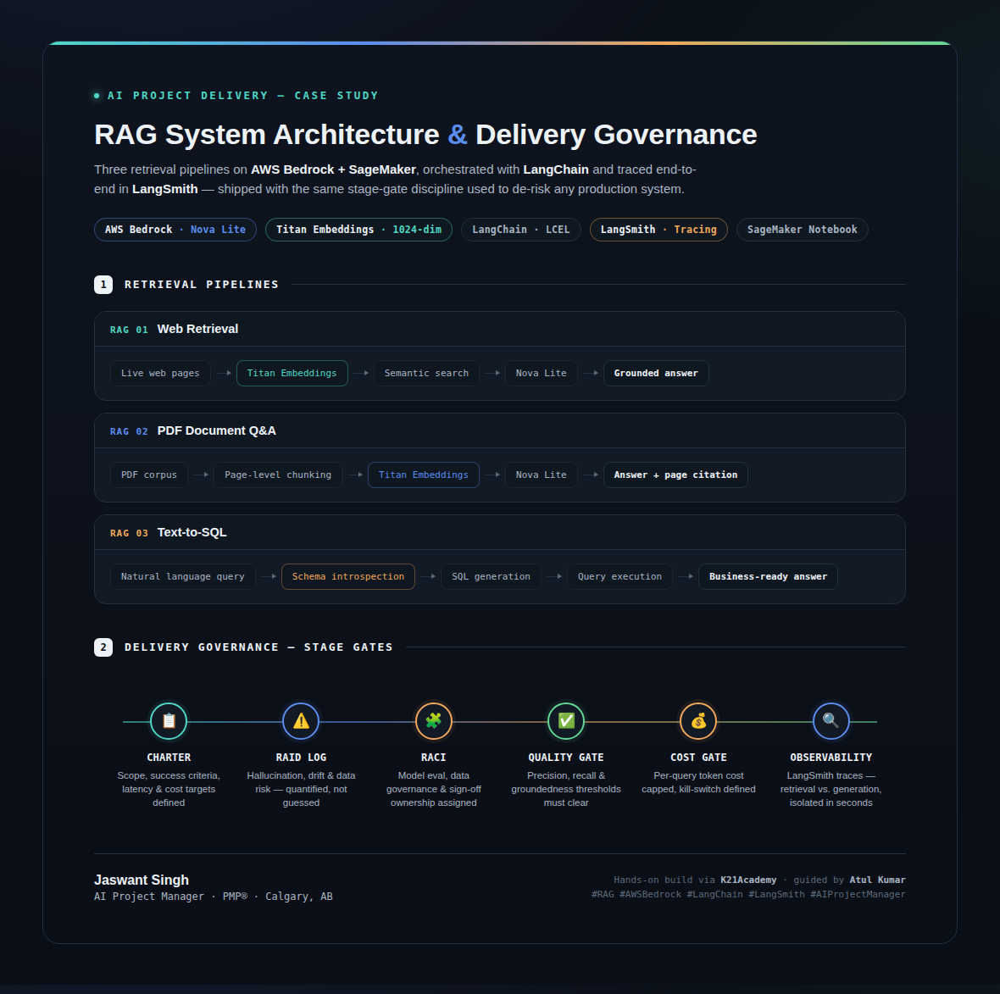
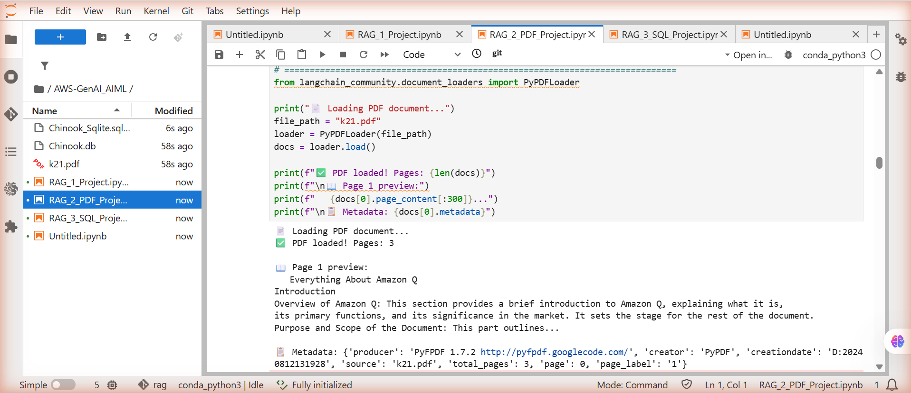
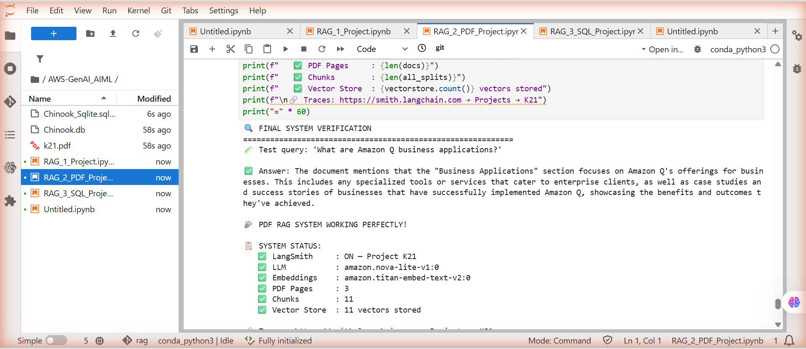
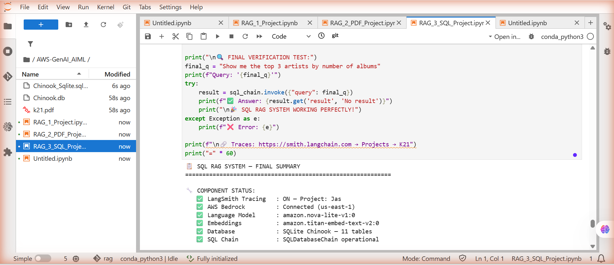
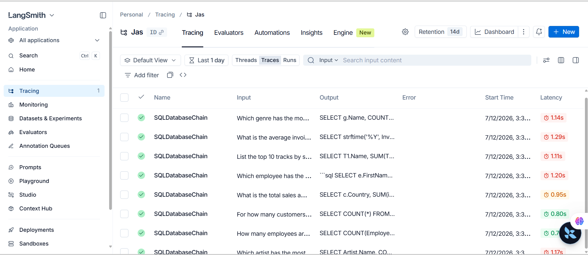

# RAG System Architecture & Delivery Governance
### Three Retrieval-Augmented Generation Pipelines on AWS Bedrock & SageMaker

[]()
[]()
[]()
[]()

Three independent retrieval pipelines — **web**, **PDF**, and **SQL** — built on AWS Bedrock, orchestrated with LangChain, and traced end-to-end in LangSmith. Delivered with the same stage-gate discipline used to de-risk any production system.



---

## Why RAG?

Traditional LLMs only know what they were trained on. Retrieval-Augmented Generation extends this by retrieving relevant documents or data at query time and injecting them as context — enabling accurate, up-to-date, domain-specific answers without retraining the model.

This project applies that pattern to three of the most common enterprise data shapes: **live web content**, **PDF documents**, and **relational databases** — replacing manual analyst lookups (1–3 day turnaround) with grounded answers delivered in under 30 seconds.

## What's in this repo

| Pipeline | Notebook | What it does |
|---|---|---|
| **RAG 1 — Web Retrieval** | `notebooks/RAG_1_Project.ipynb` | Loads live web pages, embeds with Titan, retrieves via semantic search, generates grounded answers with Nova Lite |
| **RAG 2 — PDF Document Q&A** | `notebooks/RAG_2_PDF_Project.ipynb` | Parses a PDF corpus with page-level chunking, retrieves relevant chunks, returns answers with page-level citation |
| **RAG 3 — Text-to-SQL** | `notebooks/RAG_3_SQL_Project.ipynb` | Translates natural language questions into SQL against the Chinook relational database, executes, and returns business-ready answers |

Every pipeline is traced end-to-end in **LangSmith**, so retrieval and generation steps can be isolated and debugged independently.

## Architecture

```
Prompt + Query → Search Relevant Information → Knowledge Sources (docs / web / SQL)
       ↓                                              ↓
       └──────────── Relevant Info / Enhanced Context ←┘
                            ↓
        Prompt + Query + Enhanced Context → LLM (Nova Lite) → Generated Response
```

**Common stack across all three pipelines:**
- **AWS Bedrock** — Amazon Nova Lite (generation) + Titan Embeddings V2 (1024-dim, semantic search)
- **LangChain (LCEL)** — orchestrates retrieval → context injection → generation
- **LangSmith** — tracing, latency monitoring, and debugging for every run
- **Amazon SageMaker Notebook** — development and execution environment

## Screenshots

**RAG 2 — Loading and chunking the PDF corpus:**



**RAG 2 — Final system verification (3 pages → 11 chunks → 11 vectors stored):**



**RAG 3 — Text-to-SQL final verification against the Chinook database:**



**LangSmith tracing — SQLDatabaseChain runs with latency per query:**



## Delivery governance

This project was built with the same stage-gate discipline used to de-risk any production AI delivery, not just as a standalone script:

- **Charter** — scope, success criteria, latency & cost targets defined upfront
- **RAID Log** — hallucination, drift, and data risks quantified, not guessed
- **RACI** — model evaluation, data governance, and sign-off ownership assigned
- **Quality Gate** — precision, recall, and groundedness thresholds must clear before promotion
- **Cost Gate** — per-query token cost capped, with a defined kill-switch
- **Observability** — LangSmith traces isolate retrieval vs. generation latency in seconds

## Sample results

| Query | Result |
|---|---|
| *"What are Amazon Q business applications?"* (RAG 2 — PDF) | Answer grounded in PDF content, correctly scoped to enterprise business applications and case studies |
| *"Show me the top 3 artists by number of albums"* (RAG 3 — SQL) | Generated and executed a correct multi-table JOIN + GROUP BY + ORDER BY query against the Chinook database |

## Getting started

### Prerequisites
- A paid AWS account with Bedrock access enabled in your region
- A LangSmith account (free tier is sufficient) — [smith.langchain.com](https://smith.langchain.com)
- An IAM role with `AmazonBedrockFullAccess` and SageMaker notebook access

### Setup

1. Clone this repo:
   ```bash
   git clone https://github.com/JaswantOnGit/aws-bedrock-sagemaker-rag-pipeline.git
   ```

2. Install dependencies:
   ```bash
   pip install -r requirements.txt
   ```

3. Create a `.env` file (never commit this) with:
   ```
   LANGCHAIN_API_KEY=your_langsmith_key_here
   LANGCHAIN_PROJECT=your_project_name
   AWS_REGION=us-east-1
   ```

4. Open any notebook in `notebooks/` inside a SageMaker Jupyter environment (or locally with AWS credentials configured) and run cells sequentially.

### Cost

Each full run costs approximately **$0.02–$0.20** — Nova Lite generation (~$0.02–$0.10) and Titan Embeddings (~$0.01–$0.05). Well within AWS Free Tier credits.

## Tech stack

`AWS Bedrock` · `Amazon Nova Lite` · `Amazon Titan Embeddings V2` · `LangChain (LCEL)` · `LangSmith` · `Amazon SageMaker Notebooks` · `Python` · `boto3` · `SQLite (Chinook)`

## Key takeaways

- Designing three retrieval pipelines against the *same* generation backend clarifies where RAG complexity actually lives — it's almost entirely in the retrieval and chunking strategy, not the LLM call itself
- Text-to-SQL RAG needs tighter guardrails than document RAG: schema introspection and query validation matter more than embedding quality
- End-to-end tracing (LangSmith) turned debugging from guesswork into a five-minute latency isolation exercise

## Acknowledgments

Hands-on build completed via [K21Academy](https://www.linkedin.com/company/k21academy), guided by [Atul Kumar](https://www.linkedin.com/in/atulk21academy/).

## Author

**Jaswant Singh** — PMP®, AI Project Manager | Calgary, AB
[LinkedIn](https://www.linkedin.com) · [GitHub](https://github.com/JaswantOnGit)

## License

MIT License — see [LICENSE](LICENSE) for details.
